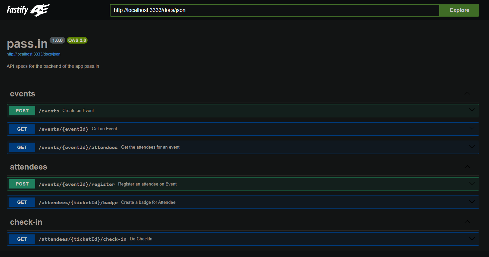
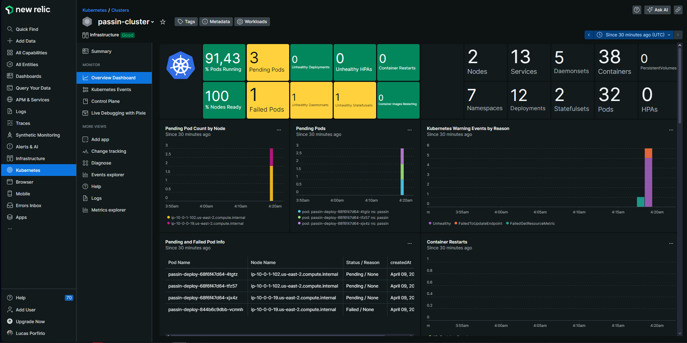

<p align="center">
  <a href="" rel="noopener">
 </a>
</p>
<h1 align="center">pass.in</h1>

<div align="center">

[]() <br>

</div>

---

## 📝 Table of Contents <a name = "en"></a>

- **[About](#about_en)**
- **[Application Flow](#application_flow)**
- **[Getting Started](#getting_started_en)**
- **[Usage](#usage_en)**
- **[Requirements](#requirements)**
- **[Project Structure](#project_structure_en)**
- **[Technologies](#built_using_en)**
- **[Devops](#devops)**

## 📚 About <a name = "about_en"></a>

Pass.in is an Event Management System that allows users to manage events, register attendees, and generate event badges. It provides a set of API endpoints for creating events, registering attendees, checking in attendees, and retrieving event and attendee information.

## ➡ Application Flow <a name = "application_flow"></a>

<p align="center">
  <a href="" rel="noopener">
 </a>
</p>

## 🏁 Getting Started <a name = "getting_started_en"></a>

These instructions will allow you to get a copy of the project and run the application locally for development and testing purposes.

### Prerequisites

- First, you need to have NodeJS installed on your machine. To do this, access the official NodeJS website by clicking [here](https://nodejs.org/) and follow the installation instructions for your operating system.<br />
- You also need to have an application to test HTTP requests, which is capable of making HTTP requests. For this, you can use Insomnia, Postman, Hoppscotch or any other application of your choice. You can also access Swagger documentation by visiting:

  > http://localhost:3333/docs

### Installation

1. Clone the repository using the command or download the .zip file and extract the contents:

   ```sh
   git clone https://github.com/lukeskw/nodejs-events-api
   ```

2. Access the project folder

3. Install the project dependencies

   ```sh
   npm install
   ```

4. Run docker compose

   ```sh
   docker compose up -d
   ```

5. Migrate the DB and then seed it

   ```sh
   npm run db:migrate
   npm run db:seed
   ```

6. Run the project in development mode

   ```sh
   npm run dev
   ```

7. To access the Prisma Studio for managing the database, you can use the following command:

   ```sh
   npm run db:studio
   ```

## 🎈 Usage <a name="usage_en"></a>

To use the application, you can utilize the following API endpoints:

### pass.in routes

<details>
<summary>Events</summary>

### Create Event

- **Method:** POST
- **Route:** `/events`
- **Request body:**

  ```json
  {
    "title": "Event Name",
    "details": "Event Details",
    "maximumAttendees": 50
  }
  ```

- Example response:

  ```json
  {
    "eventId": "c6d77ac0-d638-4d3e-9a15-a196a8cdff1a"
  }
  ```

### Get Event

- **Method:** GET
- **Route:** `/events/:eventId`
- **Request parameters:**
  - eventId: Event id that can be obtained when creating the event or by accessing the data in the database
- **Request body:** `Not Required`
- Example response:

  ```json
  {
    "event": {
      "id": "16b9c10f-c291-419a-b76d-48c7b80a9577",
      "title": "Event Title",
      "details": "Event Details",
      "maximumAttendees": 50,
      "slug": "event-title",
      "totalAttendees": 1
    }
  }
  ```

### Get Event Attendees

- **Method:** GET
- **Route:** `/events/:eventId/attendees`
- **Request parameters:**
  - `eventId`: Event id that can be obtained when creating the event or by accessing the data in the database
- **Request body:** `Not Required`

- Example response:

  ```json
  {
    "attendees": [
      {
        "id": 1,
        "name": "Attendee 1",
        "email": "Attendee1@email.com",
        "createdAt": "2024-04-03T21:09:57.423Z",
        "checkedInAt": "2024-04-03T21:11:08.734Z"
      },
      {
        "id": 2,
        "name": "Attendee 2",
        "email": "Attendee2@email.com",
        "createdAt": "2024-04-04T21:09:57.423Z",
        "checkedInAt": "2024-04-04T21:11:08.734Z"
      }
    ]
  }
  ```

</details>

<details>
<summary>Attendees</summary>

### Register Attendee for Event

- **Method:** POST
- **Route:** `/events/:eventId/register`
- **Request parameters:**
  - `eventId`: Event id that can be obtained when creating the event or by accessing the data in the database
- **Request body:**

  ```json
  {
    "name": "Attendee Name",
    "email": "Attendee@email.com"
  }
  ```

- Example response:

  ```json
  {
    "ticketId": "43js6FdM"
  }
  ```

### Get Attendee Badge

- **Method:** GET
- **Route:** `/attendees/:ticketId/badge`
- **Request parameters:**

  - ticketId: Ticket id that can be obtained when registering the attendee on an Event or by accessing the data in the database

- **Request body:** `Not required`

- Example response:

  ```json
  {
    "badge": {
      "name": "Attendee 1",
      "email": "Attendee1@email.com",
      "eventTitle": "Event 1",
      "checkInURL": "http://localhost:3333/attendees/CfoO1E1i/check-in"
    }
  }
  ```

</details>

<details>
<summary>CheckIns</summary>

### Check In Attendee

- **Method:** GET
- **Route:** `attendees/:ticketId/check-in`
- **Request parameters:**
  - `ticketId`: Ticket id that can be obtained when registering the attendee on an Event or by accessing the data in the database
- **Request body:** `Not Required`

- Example response: `201 CREATED`

</details>

## 🔧 Requirements <a name = "requirements"></a>

### Functional Requirements

- The organizer must be able to register a new event;
- The organizer must be able to view event details;
- The organizer must be able to view the list of participants;
- The participant must be able to register for an event;
- The participant must be able to view their registration badge;
- The participant must be able to check in at the event;

### Non-Functional Requirements

- Event check-in will be done through a QRCode;

### Business Rules

- A participant can only register for an event once;
- A participant can only register for events with available spots;
- A participant can only check in at an event once;

## 📁 Project Structure <a name = "project_structure_en"></a>

The project structure is as follows:

```
├── src: folder where the application files are located.
│ ├── exceptions: folder where the application exceptions are located.
│ │ ├── bad-request.exception.ts: File for handling bad request exceptions.
│ ├── http: folder where the application HTTP-related files are located.
│ │ ├── routes: folder where the application routes are located.
│ │ │ ├── attendees: folder where attendee-related routes are located.
│ │ │ │   ├── register-attendee-for-event.routes.ts: Route for registering attendees for event.
│ │ │ │   ├── get-attendee-badge.routes.ts: Route file for getting an attendee's badge.
│ │ │ ├── checkins: folder where check-in-related routes are located.
│ │ │ │   ├── check-in.ts: Route file for checking in an attendee to an event.
│ │ │ ├── events: folder where event-related routes are located.
│ │ │ │   ├── create-events.routes.ts: Route file for creating events.
│ │ │ │   ├── get-event.routes.ts: Route file for getting a specific event.
│ │ │ │   ├── get-event-attendees.routes.ts: Route file for getting attendees of an event.
│ ├── server.ts: Server configuration file.
│ ├── events.routes.ts: File containing the exported functions for handling event routes.
│ ├── error-handler.ts: File containing the error handling logic.
├── prisma: folder where the prisma configuration files, migrations, seeders, and database models are located.

```

## ⛏️ Technologies <a name = "built_using_en"></a>

- [x] [TypeScript](https://www.typescriptlang.org/) - Programming language
- [x] [NodeJS](https://nodejs.org/) - Execution environment
- [x] [Fastify](https://www.fastify.io/) - Framework
- [x] [Prisma](https://www.prisma.io/) - ORM
- [x] [PostgreSQL](https://www.postgresql.org/) - Database
- [x] [Docker](https://www.docker.com/) - Containers platform
- [x] [Zod](https://zod.dev) - Data validation for TypeScript
- [x] [Swagger](https://swagger.io/) - API documentation
- [x] [nanoid](https://github.com/ai/nanoid) - Unique ID generation
- [x] [fastify-type-provider-zod](https://github.com/fastify/fastify-type-provider-zod) - Request validation
- [x] [Terraform](https://www.terraform.io/) - Infrastructure as Code (IaC) tool for building, changing, and versioning infrastructure
- [x] [Kubernetes (k8s)](https://kubernetes.io/) - Container orchestration platform for automating deployment, scaling, and management of containerized applications
- [x] [Helm](https://helm.sh/) - Package manager for Kubernetes, used to define, install, and manage applications on Kubernetes
- [x] [Argo CD](https://argo-cd.readthedocs.io/en/stable/) - Declarative, GitOps continuous delivery tool for Kubernetes
- [x] [AWS EKS](https://aws.amazon.com/eks/) - Amazon Elastic Kubernetes Service, a managed Kubernetes service provided by AWS
- [x] [New Relic](https://newrelic.com/) - Application performance monitoring (APM) tool for monitoring and troubleshooting applications and infrastructure
- [x] [DigitalOcean](https://www.digitalocean.com/) - Cloud infrastructure provider offering droplets (virtual private servers), managed databases, and more
- [x] [GitHub Actions](https://github.com/features/actions) - Continuous Integration/Continuous Deployment (CI/CD) tool provided by GitHub

## 🛠️ Devops <a name = "devops"></a>

This part will be a set of commands to run to assure that the pipelines are running properly

<details>
<summary>Terraform</summary>

## Terraform

### Source Code

[digital ocean database](/devops/terraform/)

### Commands

- terraform init
- terraform fmt
- terraform plan
- terraform apply -auto-approve
- terraform plan --destroy

### Useful Links

- [Terraform Registry](https://registry.terraform.io/)
- [Terraform digitalocean_database_cluster](https://registry.terraform.io/providers/digitalocean/digitalocean/latest/docs/resources/database_cluster)
- [digitalocean_database_db](https://registry.terraform.io/providers/digitalocean/digitalocean/latest/docs/resources/database_db) <-

</details>

<details>
<summary>K8S</summary>

## Kubernetes (k8s)

### Source Code

[namespace test](/devops/k8s-example-with-nginx/)

[namespace nlw](/devops/k8s/)

### Commands

#### Cluster

- k3d cluster create unite --servers 2
- kubectl cluster-info

#### Info

- kubectl get nodes
- kubectl get pods
- kubectl get pods -n passin
- kubectl get pods -n kube-system

#### Namespace test

- kubectl create ns test
- kubectl get pods -n test
- kubectl apply -f k8s-test/deployment.yaml -n test
- kubectl get deployment -n test
- kubectl get pods -n test
- kubectl get replicaset -n test
- kubectl port-forward pod/[pod-name] -n test 3333:80
- kubectl apply -f k8s-test -n test
- kubectl get service -n test
- kubectl port-forward svc/nginx-service -n test 3333:80

#### Namespace passin

- kubectl create ns passin
- kubectl apply -f k8s -n passin
- kubectl get deployment -n passin
- watch kubectl get pods -n passin
- kubectl logs [pod-name] -n passin
- kubectl top pods -n passin
- kubectl top nodes -n passin
- kubectl port-forward svc/passin-service -n test 3333:3001
- kubectl apply -f k8s -n passin
- kubectl get pods -n passin

</details>

<details>
<summary>Helm</summary>

## Helm

### Commands

- helm create deploy

### Source Code

[Generated by helm create deploy](/devops/deploy/)

### Continuation Commands

#### Base (inside the deploy folder)

- kubectl create ns passin-helm
- helm upgrade --install passin ./deploy -n passin-helm
- kubectl get pods -n passin-helm
- helm list -n passin-helm
- kubectl logs [pod-name] -n passin-helm

#### Argo CD

- kubectl create namespace argocd
- kubectl apply -n argocd -f https://raw.githubusercontent.com/argoproj/argo-cd/stable/manifests/install.yaml
- kubectl get svc -n argocd
- kubectl port-forward svc/argocd-server -n argocd 3001:80
- kubectl -n argocd get secret argocd-initial-admin-secret -o jsonpath="{.data.password}" | base64 -d
- [browser] http://localhost:3001 user:admin password:[secret returned above]

#### Source Code

[cross](/devops/cross/apps/passin/)

#### Argo CD continuation (inside the cross folder)

- kubectl apply -n argocd -f apps/passin
- [browser] http://localhost:3001
- kubectl delete -n passin
- kubectl delete -n passin-helm
- kubectl create ns passin
- kubectl port-forward svc/argocd-server -n argocd 3001:80
- [browser] http://localhost:3001
- watch kubectl get pods -n passin
- kubectl port-forward svc/passin-deploy -n passin 3333:80
- [browser] http://localhost:3333/docs

#### Adding health endpoint

- kubectl port-forward svc/passin-deploy -n passin 3333:80
- [browser] http://localhost:3333/health

</details>

<details>
<summary>AWS EKS</summary>

### AWS EKS

#### Commands (cross folder)

- aws configure sso
- aws eks --region us-east-2 update-kubeconfig --name passin-eks
- kubectl get pods -n kube-system
- kubectl create namespace argocd
- kubectl apply -n argocd -f https://raw.githubusercontent.com/argoproj/argo-cd/stable/manifests/install.yaml
- kubectl apply -n argocd -f apps/passin
- kubectl port-forward svc/argocd-server -n argocd 3001:80
- kubectl -n argocd get secret argocd-initial-admin-secret -o jsonpath="{.data.password}" | base64 -d
- [browser] http://localhost:3001 user:admin password:[secret returned above]
- kubectl create ns passin
- [browser] http://localhost:3001 sync
- watch kubectl get pods -n passin
- add load balancer git commit
- kubectl port-forward svc/argocd-server -n argocd 3001:80
- [browser] http://localhost:3001 sync
- watch kubectl get pods -n passin
- kubectl get svc -n passin
- [browser] [external ip]/docs
- [browser] [external ip]/health

</details>

<details>
<summary>New Relic</summary>

### New Relic

- New Relic Dashboard
- All Entities -> Kubernetes -> Helm -> Create a new key -> Continue
- Fill cluster name -> Continue
- Keep -> Continue
- Keep -> Continue
- -> Copy to clipboard
- Paste and run in terminal
- [browser] http://localhost:3001 sync
- -> Continue
- -> Test connection
- -> See your data
- -> [cluster name]
- Summary
- Overview Dashboard
- Control Plane

</details>

### New Relic Running

<p align="center">
  <a href="" rel="noopener">
 </a>
</p>

### Useful Links

- [Argo CD Docs](https://argo-cd.readthedocs.io/en/stable)
- [New Relic](https://newrelic.com/welcome-back)
- [New Relic Dashboard](https://one.newrelic.com)
