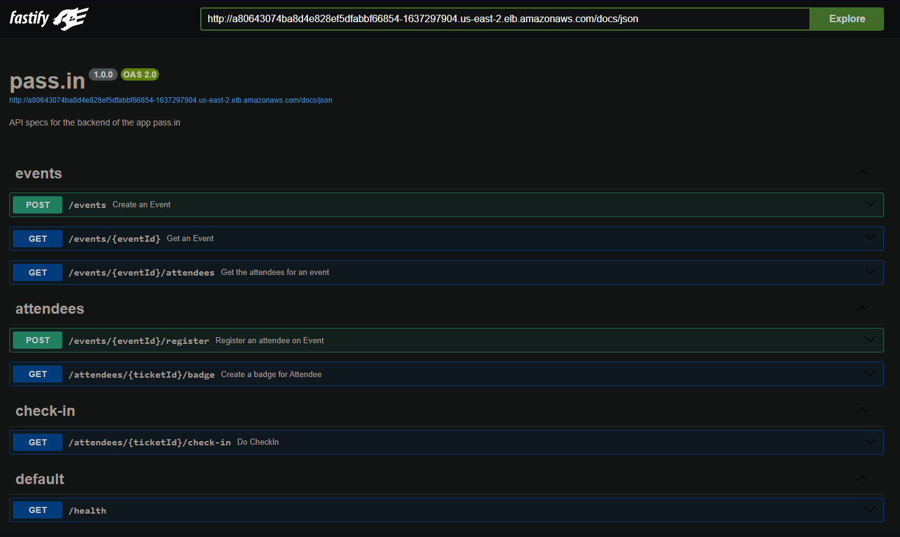

<p align="center">
  <a href="" rel="noopener">
 </a>
</p>
<h1 align="center">pass.in</h1>

<div align="center">

[]() <br>

</div>

---

## 📝 Table of Contents <a name = "en"></a>

- **[About](#about_en)**
- **[Getting Started](#getting_started_en)**
- **[Usage](#usage_en)**
- **[Project Structure](#project_structure_en)**
- **[Technologies](#built_using_en)**

## 📚 About <a name = "about_en"></a>

Pass.in is an Event Management System that allows users to manage events, register attendees, and generate event badges. It provides a set of API endpoints for creating events, registering attendees, checking in attendees, and retrieving event and attendee information.

## 🏁 Getting Started <a name = "getting_started_en"></a>

These instructions will allow you to get a copy of the project and run the application locally for development and testing purposes.

### Prerequisites

- First, you need to have NodeJS installed on your machine. To do this, access the official NodeJS website by clicking [here](https://nodejs.org/) and follow the installation instructions for your operating system.<br />
- You also need to have an application to test HTTP requests, which is capable of making HTTP requests. For this, you can use Insomnia, Postman, Hoppscotch or any other application of your choice. You can also access Swagger documentation by visiting:

  > http://localhost:3333/docs

### Installation

1. Clone the repository using the command or download the .zip file and extract the contents:

   ```sh
   git clone https://github.com/lukeskw/nodejs-events-api
   ```

2. Access the project folder

3. Install the project dependencies

   ```sh
   npm install
   ```

4. Run docker compose

   ```sh
   docker compose up -d
   ```

5. Migrate the DB and then seed it

   ```sh
   npm run db:migrate
   npm run db:seed
   ```

6. Run the project in development mode

   ```sh
   npm run dev
   ```

7. To access the Prisma Studio for managing the database, you can use the following command:

   ```sh
   npm run db:studio
   ```

## 🎈 Usage <a name="usage_en"></a>

To use the application, you can utilize the following API endpoints:

### pass.in routes

<details>
<summary>Events</summary>

### Create Event

- **Method:** POST
- **Route:** `/events`
- **Request body:**

  ```json
  {
    "title": "Event Name",
    "details": "Event Details",
    "maximumAttendees": 50
  }
  ```

- Example response:

  ```json
  {
    "eventId": "c6d77ac0-d638-4d3e-9a15-a196a8cdff1a"
  }
  ```

### Get Event

- **Method:** GET
- **Route:** `/events/:eventId`
- **Request parameters:**
  - eventId: Event id that can be obtained when creating the event or by accessing the data in the database
- **Request body:** `Not Required`
- Example response:

  ```json
  {
    "event": {
      "id": "16b9c10f-c291-419a-b76d-48c7b80a9577",
      "title": "Event Title",
      "details": "Event Details",
      "maximumAttendees": 50,
      "slug": "event-title",
      "totalAttendees": 1
    }
  }
  ```

### Get Event Attendees

- **Method:** GET
- **Route:** `/events/:eventId/attendees`
- **Request parameters:**
  - `eventId`: Event id that can be obtained when creating the event or by accessing the data in the database
- **Request body:** `Not Required`

- Example response:

  ```json
  {
    "attendees": [
      {
        "id": 1,
        "name": "Attendee 1",
        "email": "Attendee1@email.com",
        "createdAt": "2024-04-03T21:09:57.423Z",
        "checkedInAt": "2024-04-03T21:11:08.734Z"
      },
      {
        "id": 2,
        "name": "Attendee 2",
        "email": "Attendee2@email.com",
        "createdAt": "2024-04-04T21:09:57.423Z",
        "checkedInAt": "2024-04-04T21:11:08.734Z"
      }
    ]
  }
  ```

</details>

<details>
<summary>Attendees</summary>

### Register Attendee for Event

- **Method:** POST
- **Route:** `/events/:eventId/register`
- **Request parameters:**
  - `eventId`: Event id that can be obtained when creating the event or by accessing the data in the database
- **Request body:**

  ```json
  {
    "name": "Attendee Name",
    "email": "Attendee@email.com"
  }
  ```

- Example response:

  ```json
  {
    "ticketId": "43js6FdM"
  }
  ```

### Get Attendee Badge

- **Method:** GET
- **Route:** `/attendees/:ticketId/badge`
- **Request parameters:**

  - ticketId: Ticket id that can be obtained when registering the attendee on an Event or by accessing the data in the database

- **Request body:** `Not required`

- Example response:

  ```json
  {
    "badge": {
      "name": "Attendee 1",
      "email": "Attendee1@email.com",
      "eventTitle": "Event 1",
      "checkInURL": "http://localhost:3333/attendees/CfoO1E1i/check-in"
    }
  }
  ```

</details>

<details>
<summary>CheckIns</summary>

### Check In Attendee

- **Method:** GET
- **Route:** `attendees/:ticketId/check-in`
- **Request parameters:**
  - `ticketId`: Ticket id that can be obtained when registering the attendee on an Event or by accessing the data in the database
- **Request body:** `Not Required`

- Example response: `201 CREATED`

</details>

## 📁 Project Structure <a name = "project_structure_en"></a>

The project structure is as follows:

```
├── src: folder where the application files are located.
│ ├── exceptions: folder where the application exceptions are located.
│ │ ├── bad-request.exception.ts: File for handling bad request exceptions.
│ ├── http: folder where the application HTTP-related files are located.
│ │ ├── routes: folder where the application routes are located.
│ │ │ ├── attendees: folder where attendee-related routes are located.
│ │ │ │   ├── register-attendee-for-event.routes.ts: Route for registering attendees for event.
│ │ │ │   ├── get-attendee-badge.routes.ts: Route file for getting an attendee's badge.
│ │ │ ├── checkins: folder where check-in-related routes are located.
│ │ │ │   ├── check-in.ts: Route file for checking in an attendee to an event.
│ │ │ ├── events: folder where event-related routes are located.
│ │ │ │   ├── create-events.routes.ts: Route file for creating events.
│ │ │ │   ├── get-event.routes.ts: Route file for getting a specific event.
│ │ │ │   ├── get-event-attendees.routes.ts: Route file for getting attendees of an event.
│ ├── server.ts: Server configuration file.
│ ├── events.routes.ts: File containing the exported functions for handling event routes.
│ ├── error-handler.ts: File containing the error handling logic.
├── prisma: folder where the prisma configuration files, migrations, seeders, and database models are located.

```

## ⛏️ Technologies <a name = "built_using_en"></a>

- [x] [TypeScript](https://www.typescriptlang.org/) - Programming language
- [x] [NodeJS](https://nodejs.org/) - Execution environment
- [x] [Fastify](https://www.fastify.io/) - Framework
- [x] [Prisma](https://www.prisma.io/) - ORM
- [x] [PostgreSQL](https://www.postgresql.org/) - Database
- [x] [Docker](https://www.docker.com/) - Containers platform
- [x] [Zod](https://zod.dev) - Data validation for TypeScript
- [x] [Swagger](https://swagger.io/) - API documentation
- [x] [nanoid](https://github.com/ai/nanoid) - Unique ID generation
- [x] [fastify-type-provider-zod](https://github.com/fastify/fastify-type-provider-zod) - Request validation
